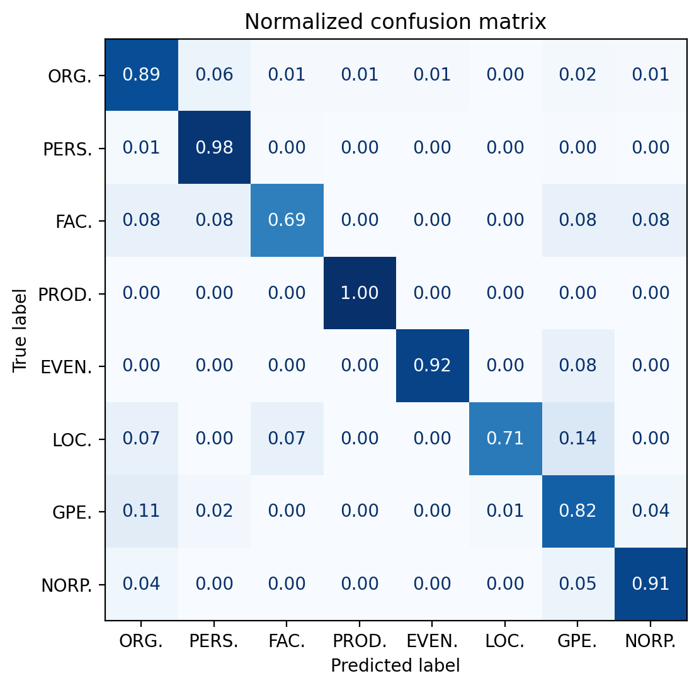

# Project

Fine-tuning of a pre-trained model for named entity recognition in English.

The data comes from news articles written in English and published in October 2025. The articles were downloaded from the Europresse platform.

The articles were first annotated using the ```english_web_core_trf``` spaCy pipeline. 

A certain number of tags included in the pipeline were excluded from the data for two reasons :
* The dataset is relatively small, the smaller the tagset the better the result
* Ultimately the goal is to analyze trends in media, so only relevant tags were kept

The annotations were then corrected by 4 annotators, and exported in a .csv file to be used as data to fine-tune the model.

**Please note that much of the code used here is either inspired by or directly taken from Ms. Delphine Bernhard's Machine Learning course given at the Université de Strasbourg.**
<br></br>

# Details

Tagset : ['PERSON', 'GPE', 'ORG', 'FAC', 'EVENT', 'PRODUCT', 'LOC', 'NORP']

Pre-trained model used : https://huggingface.co/distilbert/distilbert-base-uncased 

Files :
* model_fine_tuning_NER.ipynb : data processing and fine-tuning of the model
* correction_annotation - corpus_anno_no_text.csv : training data
* results.json : results
* confusion_matrix.png : confusion matrix
<br></br>

# Results


